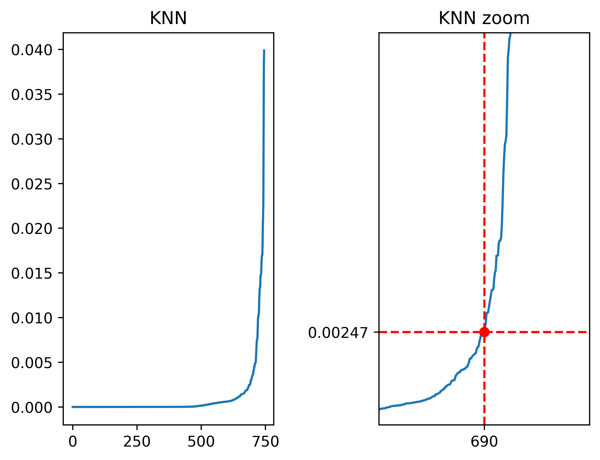
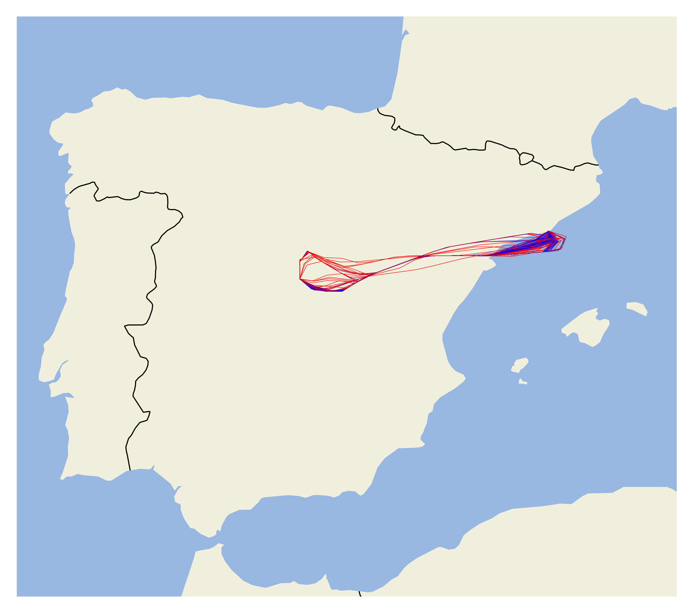
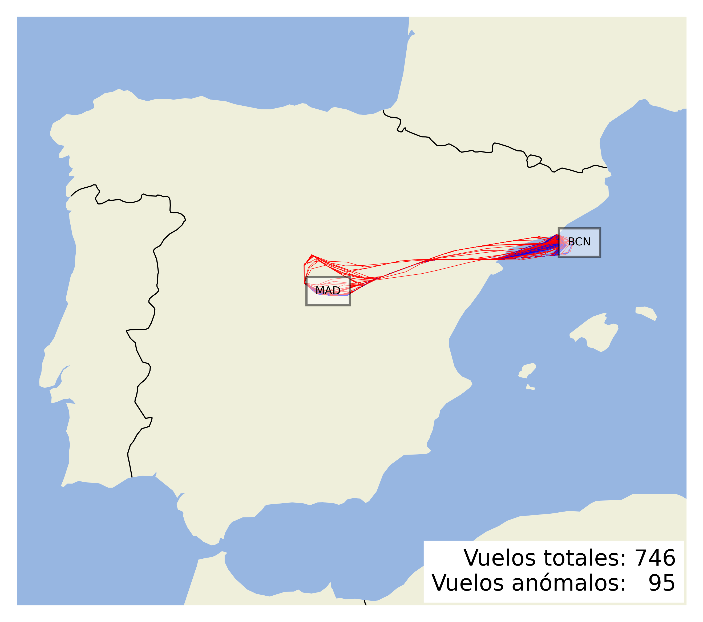
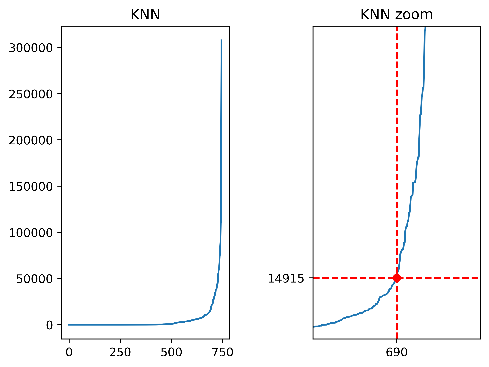
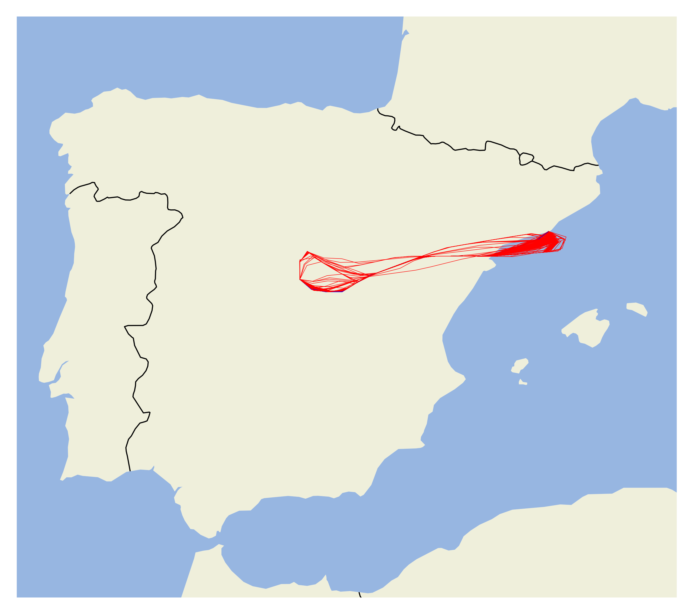

# Resume

## Silhouette

Best algorithm/function distance configuration based on silhouette score.

|   clusters |   outliers |    noise |    score | algorithm   | distance_fn    |
|-----------:|-----------:|---------:|---------:|:------------|:---------------|
|          7 |         95 | 12.7346  | 0.724754 | dbscan      | erp_distances  |
|          5 |        102 | 13.6729  | 0.7124   | dbscan      | sspd_distances |
|         12 |         65 |  8.71314 | 0.544197 | hdbscan     | erp_distances  |
|         13 |         77 | 10.3217  | 0.428504 | hdbscan     | sspd_distances |

Score represents the quality of the clustering. The best score is 1.0 and the worst score is -1.0. Scores around zero indicate overlapping clusters.

# Resume

## Davies-Bouldin

Best algorithm/function distance configuration based on davies_bouldin score.

|   clusters |   outliers |    noise |    score | algorithm   | distance_fn    |
|-----------:|-----------:|---------:|---------:|:------------|:---------------|
|         15 |         55 |  7.37265 | 1.16077  | dbscan      | sspd_distances |
|          4 |        155 | 20.7775  | 1.1529   | dbscan      | erp_distances  |
|          3 |        358 | 47.9893  | 0.965924 | hdbscan     | sspd_distances |
|         12 |         66 |  8.84718 | 0.940577 | hdbscan     | erp_distances  |

The minimum score is zero, with lower values indicating better clustering.

-----------------------

# dbscan

## sspd_distances

### silhouette

#### Optimal epsilon visual representation

#### Search params result

|   clusters |   outliers |    noise | method     |    score |        eps |   min_samples |
|-----------:|-----------:|---------:|:-----------|---------:|-----------:|--------------:|
|          5 |        102 | 13.6729  | silhouette | 0.7124   | 0.00247358 |             8 |
|          5 |        104 | 13.941   | silhouette | 0.709502 | 0.00247358 |             9 |
|          5 |        108 | 14.4772  | silhouette | 0.701637 | 0.00247358 |            10 |
|          5 |        108 | 14.4772  | silhouette | 0.701637 | 0.00247358 |            11 |
|          5 |        109 | 14.6113  | silhouette | 0.701182 | 0.00247358 |            12 |
|          5 |        109 | 14.6113  | silhouette | 0.701182 | 0.00247358 |            13 |
|          5 |        109 | 14.6113  | silhouette | 0.701182 | 0.00247358 |            14 |
|          5 |        111 | 14.8794  | silhouette | 0.697948 | 0.00247358 |            15 |
|          8 |         74 |  9.91957 | silhouette | 0.673669 | 0.00247358 |             4 |
|          6 |         89 | 11.9303  | silhouette | 0.671341 | 0.00247358 |             6 |

#### Best estimator result

|   clusters |   outliers |   noise | method     |   score |        eps |   min_samples |
|-----------:|-----------:|--------:|:-----------|--------:|-----------:|--------------:|
|          5 |        102 | 13.6729 | silhouette |  0.7124 | 0.00247358 |             8 |

### davies_bouldin

#### Optimal epsilon visual representation

#### Search params result

|   clusters |   outliers |    noise | method         |   score |        eps |   min_samples |
|-----------:|-----------:|---------:|:---------------|--------:|-----------:|--------------:|
|         15 |         55 |  7.37265 | davies_bouldin | 1.16077 | 0.00247358 |             2 |
|          7 |         84 | 11.2601  | davies_bouldin | 1.21686 | 0.00247358 |             5 |
|          6 |         89 | 11.9303  | davies_bouldin | 1.22219 | 0.00247358 |             6 |
|         12 |         61 |  8.17694 | davies_bouldin | 1.23383 | 0.00247358 |             3 |
|          6 |         93 | 12.4665  | davies_bouldin | 1.25515 | 0.00247358 |             7 |
|          8 |         74 |  9.91957 | davies_bouldin | 1.27035 | 0.00247358 |             4 |
|          5 |        102 | 13.6729  | davies_bouldin | 1.39    | 0.00247358 |             8 |
|          5 |        104 | 13.941   | davies_bouldin | 1.39938 | 0.00247358 |             9 |
|          5 |        108 | 14.4772  | davies_bouldin | 1.41546 | 0.00247358 |            10 |
|          5 |        108 | 14.4772  | davies_bouldin | 1.41546 | 0.00247358 |            11 |

#### Best estimator result

|   clusters |   outliers |   noise | method         |   score |        eps |   min_samples |
|-----------:|-----------:|--------:|:---------------|--------:|-----------:|--------------:|
|         15 |         55 | 7.37265 | davies_bouldin | 1.16077 | 0.00247358 |             2 |

## erp_distances

### silhouette

#### Optimal epsilon visual representation

#### Search params result

|   clusters |   outliers |   noise | method     |    score |     eps |   min_samples |
|-----------:|-----------:|--------:|:-----------|---------:|--------:|--------------:|
|          7 |         95 | 12.7346 | silhouette | 0.724754 | 14915.3 |             5 |
|          7 |        108 | 14.4772 | silhouette | 0.710267 | 14915.3 |             7 |
|          7 |        111 | 14.8794 | silhouette | 0.704169 | 14915.3 |             8 |
|          6 |        120 | 16.0858 | silhouette | 0.688994 | 14915.3 |             9 |
|          6 |        123 | 16.4879 | silhouette | 0.685175 | 14915.3 |            10 |
|          4 |        155 | 20.7775 | silhouette | 0.681781 | 14915.3 |            15 |
|          8 |         98 | 13.1367 | silhouette | 0.681636 | 14915.3 |             6 |
|          9 |         79 | 10.5898 | silhouette | 0.672156 | 14915.3 |             4 |
|          5 |        133 | 17.8284 | silhouette | 0.668961 | 14915.3 |            11 |
|          5 |        135 | 18.0965 | silhouette | 0.665258 | 14915.3 |            12 |

#### Best estimator result

|   clusters |   outliers |   noise | method     |    score |     eps |   min_samples |
|-----------:|-----------:|--------:|:-----------|---------:|--------:|--------------:|
|          7 |         95 | 12.7346 | silhouette | 0.724754 | 14915.3 |             5 |

### davies_bouldin

#### Optimal epsilon visual representation

#### Search params result

|   clusters |   outliers |   noise | method         |   score |     eps |   min_samples |
|-----------:|-----------:|--------:|:---------------|--------:|--------:|--------------:|
|          4 |        155 | 20.7775 | davies_bouldin | 1.1529  | 14915.3 |            15 |
|          7 |         95 | 12.7346 | davies_bouldin | 1.18059 | 14915.3 |             5 |
|          7 |        108 | 14.4772 | davies_bouldin | 1.19655 | 14915.3 |             7 |
|          7 |        111 | 14.8794 | davies_bouldin | 1.20367 | 14915.3 |             8 |
|          8 |         98 | 13.1367 | davies_bouldin | 1.21891 | 14915.3 |             6 |
|          6 |        123 | 16.4879 | davies_bouldin | 1.23216 | 14915.3 |            10 |
|          6 |        120 | 16.0858 | davies_bouldin | 1.2378  | 14915.3 |             9 |
|          5 |        133 | 17.8284 | davies_bouldin | 1.29855 | 14915.3 |            11 |
|          5 |        136 | 18.2306 | davies_bouldin | 1.30097 | 14915.3 |            13 |
|          5 |        135 | 18.0965 | davies_bouldin | 1.30117 | 14915.3 |            12 |

#### Best estimator result

|   clusters |   outliers |   noise | method         |   score |     eps |   min_samples |
|-----------:|-----------:|--------:|:---------------|--------:|--------:|--------------:|
|          4 |        155 | 20.7775 | davies_bouldin |  1.1529 | 14915.3 |            15 |

# hdbscan

## sspd_distances

### silhouette

#### Search params result

|   clusters |   outliers |   noise | method     |    score |   min_samples |   min_cluster_size |
|-----------:|-----------:|--------:|:-----------|---------:|--------------:|-------------------:|
|         13 |         77 | 10.3217 | silhouette | 0.428504 |             6 |                  5 |
|         12 |         86 | 11.5282 | silhouette | 0.417295 |             7 |                  5 |
|         12 |         82 | 10.992  | silhouette | 0.417217 |             6 |                 10 |
|         11 |        101 | 13.5389 | silhouette | 0.416634 |             9 |                 10 |
|         12 |         88 | 11.7962 | silhouette | 0.412738 |             8 |                  5 |
|         12 |         88 | 11.7962 | silhouette | 0.412738 |             8 |                 10 |
|         10 |        113 | 15.1475 | silhouette | 0.405026 |            10 |                 10 |
|         12 |         92 | 12.3324 | silhouette | 0.404697 |             9 |                  5 |
|         12 |         97 | 13.0027 | silhouette | 0.396985 |            10 |                  2 |
|         13 |         94 | 12.6005 | silhouette | 0.393922 |             9 |                  2 |

#### Best estimator result

|   clusters |   outliers |   noise | method     |    score |   min_samples |   min_cluster_size |
|-----------:|-----------:|--------:|:-----------|---------:|--------------:|-------------------:|
|         13 |         77 | 10.3217 | silhouette | 0.428504 |             6 |                  5 |

### davies_bouldin

#### Search params result

|   clusters |   outliers |   noise | method         |    score |   min_samples |   min_cluster_size |
|-----------:|-----------:|--------:|:---------------|---------:|--------------:|-------------------:|
|          3 |        358 | 47.9893 | davies_bouldin | 0.965924 |             1 |                100 |
|          3 |        358 | 47.9893 | davies_bouldin | 0.965924 |             1 |                120 |
|          3 |        358 | 47.9893 | davies_bouldin | 0.965924 |             1 |                140 |
|          3 |        358 | 47.9893 | davies_bouldin | 0.965924 |             2 |                100 |
|          3 |        358 | 47.9893 | davies_bouldin | 0.965924 |             2 |                120 |
|          3 |        358 | 47.9893 | davies_bouldin | 0.965924 |             2 |                140 |
|          3 |        360 | 48.2574 | davies_bouldin | 0.970139 |             3 |                100 |
|          3 |        360 | 48.2574 | davies_bouldin | 0.970139 |             3 |                120 |
|          3 |        360 | 48.2574 | davies_bouldin | 0.970139 |             3 |                140 |
|          3 |        361 | 48.3914 | davies_bouldin | 0.972103 |             4 |                100 |

#### Best estimator result

|   clusters |   outliers |   noise | method         |    score |   min_samples |   min_cluster_size |
|-----------:|-----------:|--------:|:---------------|---------:|--------------:|-------------------:|
|          3 |        358 | 47.9893 | davies_bouldin | 0.965924 |             1 |                100 |

## erp_distances

### silhouette

#### Search params result

|   clusters |   outliers |    noise | method     |    score |   min_samples |   min_cluster_size |
|-----------:|-----------:|---------:|:-----------|---------:|--------------:|-------------------:|
|         12 |         65 |  8.71314 | silhouette | 0.544197 |             7 |                 10 |
|         12 |         66 |  8.84718 | silhouette | 0.54362  |             8 |                 10 |
|         12 |         66 |  8.84718 | silhouette | 0.542109 |             6 |                 10 |
|         12 |         79 | 10.5898  | silhouette | 0.532598 |             9 |                  5 |
|         12 |         79 | 10.5898  | silhouette | 0.532598 |             9 |                 10 |
|         13 |         75 | 10.0536  | silhouette | 0.527887 |             8 |                  5 |
|         10 |         88 | 11.7962  | silhouette | 0.52418  |            10 |                  5 |
|         10 |         88 | 11.7962  | silhouette | 0.52418  |            10 |                 10 |
|          9 |        105 | 14.0751  | silhouette | 0.503249 |            11 |                 10 |
|          8 |        124 | 16.622   | silhouette | 0.502214 |            12 |                  5 |

#### Best estimator result

|   clusters |   outliers |   noise | method     |    score |   min_samples |   min_cluster_size |
|-----------:|-----------:|--------:|:-----------|---------:|--------------:|-------------------:|
|         12 |         65 | 8.71314 | silhouette | 0.544197 |             7 |                 10 |

### davies_bouldin

#### Search params result

|   clusters |   outliers |    noise | method         |    score |   min_samples |   min_cluster_size |
|-----------:|-----------:|---------:|:---------------|---------:|--------------:|-------------------:|
|         12 |         66 |  8.84718 | davies_bouldin | 0.940577 |             6 |                 10 |
|         12 |         65 |  8.71314 | davies_bouldin | 0.942917 |             7 |                 10 |
|          6 |        147 | 19.7051  | davies_bouldin | 0.945138 |             5 |                 40 |
|          6 |        147 | 19.7051  | davies_bouldin | 0.946484 |             7 |                 40 |
|          6 |        149 | 19.9732  | davies_bouldin | 0.947726 |             6 |                 40 |
|          6 |        149 | 19.9732  | davies_bouldin | 0.948312 |             8 |                 40 |
|          6 |        153 | 20.5094  | davies_bouldin | 0.955454 |             9 |                 40 |
|          6 |        154 | 20.6434  | davies_bouldin | 0.955748 |            10 |                 40 |
|         12 |         66 |  8.84718 | davies_bouldin | 0.956361 |             8 |                 10 |
|          6 |        156 | 20.9115  | davies_bouldin | 0.962871 |            11 |                 40 |

#### Best estimator result

|   clusters |   outliers |   noise | method         |    score |   min_samples |   min_cluster_size |
|-----------:|-----------:|--------:|:---------------|---------:|--------------:|-------------------:|
|         12 |         66 | 8.84718 | davies_bouldin | 0.940577 |             6 |                 10 |

