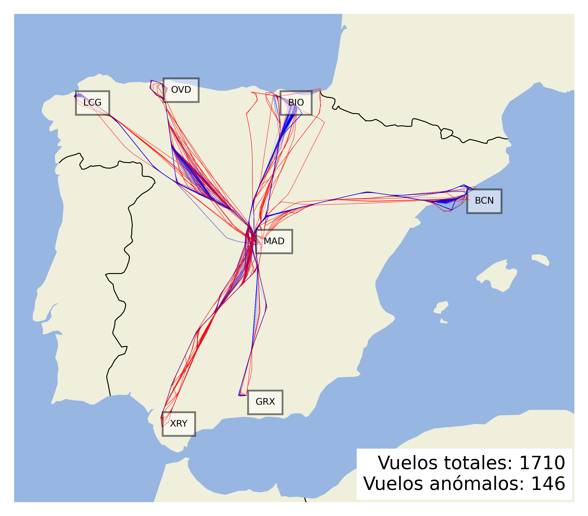
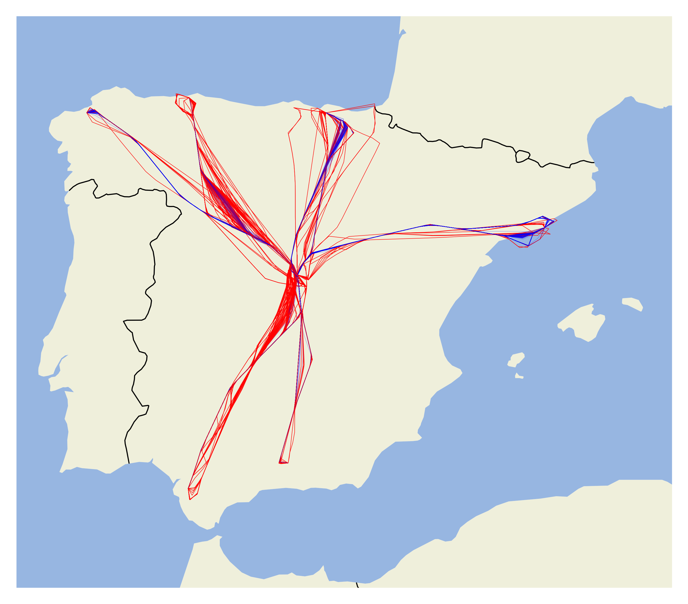
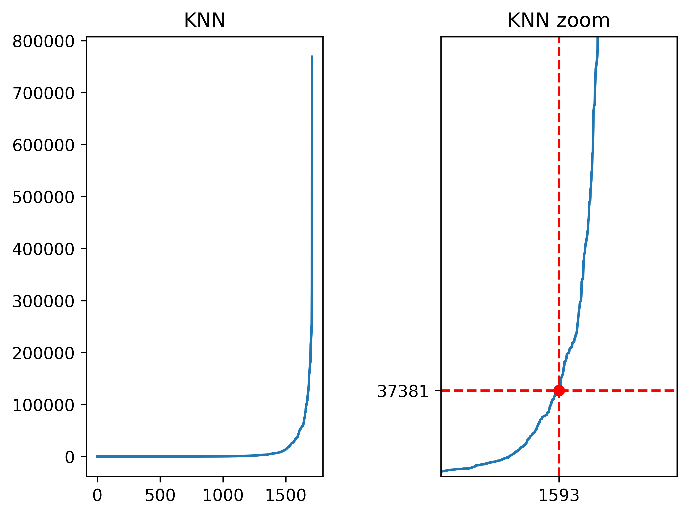
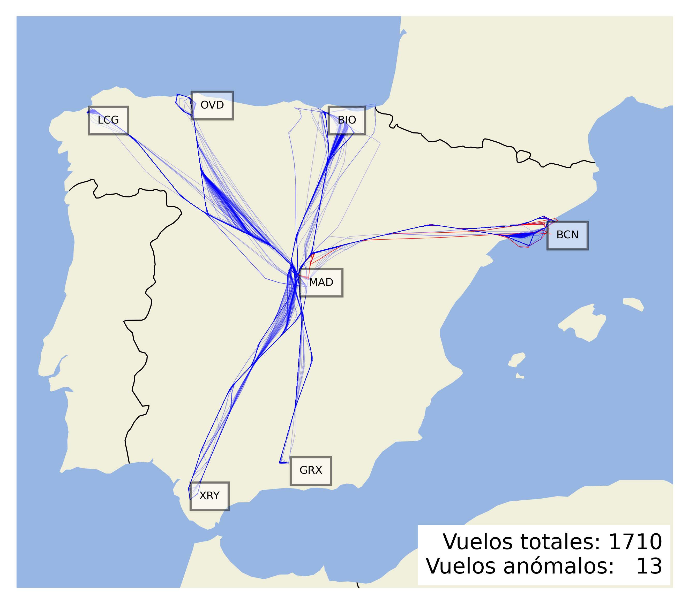

# Case 4

Flight from Madrid to Alicante, Barcelona, Bilbao, Coruña, Córdoba, Granada and Jerez taking into account the taxi period.

## Resume

### Silhouette

Best algorithm/function distance configuration based on silhouette score.

|   clusters |   outliers |    noise |    score | algorithm   | distance_fn    |
|-----------:|-----------:|---------:|---------:|:------------|:---------------|
|          9 |         13 | 0.760234 | 0.930343 | hdbscan     | erp_distances  |
|          9 |         15 | 0.877193 | 0.909046 | hdbscan     | sspd_distances |
|         41 |        146 | 8.53801  | 0.719215 | dbscan      | erp_distances  |
|         26 |        106 | 6.19883  | 0.682011 | dbscan      | sspd_distances |

Score represents the quality of the clustering. The best score is 1.0 and the worst score is -1.0. Scores around zero indicate overlapping clusters.

|               | dbscan  | hdbscan | 
|---------------|:-------:|:-------:|
| erp_distance  |  |  |
| sspd_distance |  |  |

### Davies-Bouldin

Best algorithm/function distance configuration based on davies_bouldin score.

|   clusters |   outliers |    noise |    score | algorithm   | distance_fn    |
|-----------:|-----------:|---------:|---------:|:------------|:---------------|
|         10 |         53 |  3.09942 | 0.377234 | hdbscan     | erp_distances  |
|         10 |         54 |  3.15789 | 0.541504 | hdbscan     | sspd_distances |
|         15 |        357 | 20.8772  | 0.958508 | dbscan      | erp_distances  |
|         16 |        192 | 11.2281  | 1.10647  | dbscan      | sspd_distances |

The minimum score is zero, with lower values indicating better clustering.

|               | dbscan  | hdbscan | 
|---------------|:-------:|:-------:|
| erp_distance  |  |  |
| sspd_distance |  |  |

-----------------------

# silhouette

### dbscan

Finding the best eps value.

In order to calculate the best eps value, first, the nearest neighbors of the data are calculated. Then, the points are sorted and in order to obtain a curve. Next, a line is generated that fits to the curve and the distances between each point of the curve and the line are calculated. The elbow index is the point where the distance is maximum.

As a custom distance function it is used, the distance between trajectories are normalized and epsilon values may not be true magnitudes.

#### sspd_distances

##### Search params result

|   clusters |   outliers |    noise | method     |    score |       eps |   min_samples |
|-----------:|-----------:|---------:|:-----------|---------:|----------:|--------------:|
|         26 |        106 |  6.19883 | silhouette | 0.682011 | 0.0141249 |             4 |
|         32 |         85 |  4.97076 | silhouette | 0.676396 | 0.0141249 |             3 |
|         22 |        125 |  7.30994 | silhouette | 0.674717 | 0.0141249 |             5 |
|         19 |        141 |  8.24561 | silhouette | 0.667913 | 0.0141249 |             6 |
|         19 |        141 |  8.24561 | silhouette | 0.667913 | 0.0141249 |             7 |
|         19 |        143 |  8.36257 | silhouette | 0.66637  | 0.0141249 |             8 |
|         18 |        152 |  8.88889 | silhouette | 0.65834  | 0.0141249 |             9 |
|         17 |        162 |  9.47368 | silhouette | 0.648323 | 0.0141249 |            10 |
|         16 |        192 | 11.2281  | silhouette | 0.642228 | 0.0141249 |            15 |
|         16 |        173 | 10.117   | silhouette | 0.640286 | 0.0141249 |            11 |

##### Best estimator result

|   clusters |   outliers |   noise | method     |    score |       eps |   min_samples |
|-----------:|-----------:|--------:|:-----------|---------:|----------:|--------------:|
|         26 |        106 | 6.19883 | silhouette | 0.682011 | 0.0141249 |             4 |

#### erp_distances

##### Search params result

|   clusters |   outliers |    noise | method     |    score |     eps |   min_samples |
|-----------:|-----------:|---------:|:-----------|---------:|--------:|--------------:|
|         41 |        146 |  8.53801 | silhouette | 0.719215 | 37380.5 |             3 |
|         35 |        167 |  9.76608 | silhouette | 0.702838 | 37380.5 |             4 |
|         31 |        186 | 10.8772  | silhouette | 0.69402  | 37380.5 |             5 |
|         56 |        116 |  6.78363 | silhouette | 0.693142 | 37380.5 |             2 |
|         26 |        214 | 12.5146  | silhouette | 0.685962 | 37380.5 |             6 |
|         26 |        221 | 12.924   | silhouette | 0.677559 | 37380.5 |             7 |
|         24 |        236 | 13.8012  | silhouette | 0.664868 | 37380.5 |             8 |
|         22 |        256 | 14.9708  | silhouette | 0.644516 | 37380.5 |             9 |
|         20 |        277 | 16.1988  | silhouette | 0.624933 | 37380.5 |            10 |
|         19 |        292 | 17.076   | silhouette | 0.610615 | 37380.5 |            11 |

##### Best estimator result

|   clusters |   outliers |   noise | method     |    score |     eps |   min_samples |
|-----------:|-----------:|--------:|:-----------|---------:|--------:|--------------:|
|         41 |        146 | 8.53801 | silhouette | 0.719215 | 37380.5 |             3 |

### hdbscan

#### sspd_distances

##### Search params result

|   clusters |   outliers |    noise | method     |    score |   min_samples |   min_cluster_size |
|-----------:|-----------:|---------:|:-----------|---------:|--------------:|-------------------:|
|          9 |         15 | 0.877193 | silhouette | 0.909046 |             1 |                100 |
|          9 |         16 | 0.935673 | silhouette | 0.908218 |             2 |                100 |
|          9 |         16 | 0.935673 | silhouette | 0.908218 |             3 |                100 |
|          9 |         16 | 0.935673 | silhouette | 0.908218 |             4 |                100 |
|          9 |         16 | 0.935673 | silhouette | 0.908218 |             5 |                100 |
|          9 |         16 | 0.935673 | silhouette | 0.908218 |             6 |                100 |
|          9 |         16 | 0.935673 | silhouette | 0.908218 |             7 |                100 |
|          9 |         16 | 0.935673 | silhouette | 0.908218 |             8 |                100 |
|          9 |         16 | 0.935673 | silhouette | 0.908218 |             9 |                100 |
|          9 |         16 | 0.935673 | silhouette | 0.908218 |            10 |                100 |

##### Best estimator result

|   clusters |   outliers |    noise | method     |    score |   min_samples |   min_cluster_size |
|-----------:|-----------:|---------:|:-----------|---------:|--------------:|-------------------:|
|          9 |         15 | 0.877193 | silhouette | 0.909046 |             1 |                100 |

#### erp_distances

##### Search params result

|   clusters |   outliers |    noise | method     |    score |   min_samples |   min_cluster_size |
|-----------:|-----------:|---------:|:-----------|---------:|--------------:|-------------------:|
|          9 |         13 | 0.760234 | silhouette | 0.930343 |            11 |                100 |
|          9 |         13 | 0.760234 | silhouette | 0.930343 |            12 |                100 |
|          9 |         13 | 0.760234 | silhouette | 0.929651 |            13 |                100 |
|          9 |         16 | 0.935673 | silhouette | 0.928994 |            10 |                100 |
|          9 |         15 | 0.877193 | silhouette | 0.928422 |            14 |                100 |
|          9 |         15 | 0.877193 | silhouette | 0.928422 |            15 |                100 |
|          9 |         16 | 0.935673 | silhouette | 0.928351 |             9 |                100 |
|          9 |         17 | 0.994152 | silhouette | 0.927959 |             8 |                100 |
|          9 |         17 | 0.994152 | silhouette | 0.927281 |             7 |                100 |
|          9 |         17 | 0.994152 | silhouette | 0.926117 |             6 |                100 |

##### Best estimator result

|   clusters |   outliers |    noise | method     |    score |   min_samples |   min_cluster_size |
|-----------:|-----------:|---------:|:-----------|---------:|--------------:|-------------------:|
|          9 |         13 | 0.760234 | silhouette | 0.930343 |            11 |                100 |

# davies_bouldin

### dbscan

Finding the best eps value.

In order to calculate the best eps value, first, the nearest neighbors of the data are calculated. Then, the points are sorted and in order to obtain a curve. Next, a line is generated that fits to the curve and the distances between each point of the curve and the line are calculated. The elbow index is the point where the distance is maximum.

As a custom distance function it is used, the distance between trajectories are normalized and epsilon values may not be true magnitudes.

#### sspd_distances

##### Search params result

|   clusters |   outliers |    noise | method         |   score |       eps |   min_samples |
|-----------:|-----------:|---------:|:---------------|--------:|----------:|--------------:|
|         16 |        192 | 11.2281  | davies_bouldin | 1.10647 | 0.0141249 |            15 |
|         17 |        162 |  9.47368 | davies_bouldin | 1.11225 | 0.0141249 |            10 |
|         16 |        176 | 10.2924  | davies_bouldin | 1.12493 | 0.0141249 |            12 |
|         16 |        176 | 10.2924  | davies_bouldin | 1.12493 | 0.0141249 |            13 |
|         18 |        152 |  8.88889 | davies_bouldin | 1.12525 | 0.0141249 |             9 |
|         19 |        143 |  8.36257 | davies_bouldin | 1.12687 | 0.0141249 |             8 |
|         16 |        173 | 10.117   | davies_bouldin | 1.12756 | 0.0141249 |            11 |
|         17 |        176 | 10.2924  | davies_bouldin | 1.13055 | 0.0141249 |            14 |
|         19 |        141 |  8.24561 | davies_bouldin | 1.13059 | 0.0141249 |             6 |
|         19 |        141 |  8.24561 | davies_bouldin | 1.13059 | 0.0141249 |             7 |

##### Best estimator result

|   clusters |   outliers |   noise | method         |   score |       eps |   min_samples |
|-----------:|-----------:|--------:|:---------------|--------:|----------:|--------------:|
|         16 |        192 | 11.2281 | davies_bouldin | 1.10647 | 0.0141249 |            15 |

#### erp_distances

##### Search params result

|   clusters |   outliers |   noise | method         |    score |     eps |   min_samples |
|-----------:|-----------:|--------:|:---------------|---------:|--------:|--------------:|
|         15 |        357 | 20.8772 | davies_bouldin | 0.958508 | 37380.5 |            14 |
|         15 |        357 | 20.8772 | davies_bouldin | 0.958508 | 37380.5 |            15 |
|         17 |        325 | 19.0058 | davies_bouldin | 0.990662 | 37380.5 |            13 |
|         18 |        305 | 17.8363 | davies_bouldin | 1.0137   | 37380.5 |            12 |
|         19 |        292 | 17.076  | davies_bouldin | 1.03294  | 37380.5 |            11 |
|         20 |        277 | 16.1988 | davies_bouldin | 1.03833  | 37380.5 |            10 |
|         22 |        256 | 14.9708 | davies_bouldin | 1.05704  | 37380.5 |             9 |
|         24 |        236 | 13.8012 | davies_bouldin | 1.09244  | 37380.5 |             8 |
|         26 |        221 | 12.924  | davies_bouldin | 1.10274  | 37380.5 |             7 |
|         26 |        214 | 12.5146 | davies_bouldin | 1.12029  | 37380.5 |             6 |

##### Best estimator result

|   clusters |   outliers |   noise | method         |    score |     eps |   min_samples |
|-----------:|-----------:|--------:|:---------------|---------:|--------:|--------------:|
|         15 |        357 | 20.8772 | davies_bouldin | 0.958508 | 37380.5 |            14 |

### hdbscan

#### sspd_distances

##### Search params result

|   clusters |   outliers |   noise | method         |    score |   min_samples |   min_cluster_size |
|-----------:|-----------:|--------:|:---------------|---------:|--------------:|-------------------:|
|         10 |         54 | 3.15789 | davies_bouldin | 0.541504 |             1 |                 80 |
|         10 |         55 | 3.21637 | davies_bouldin | 0.554249 |             2 |                 80 |
|         10 |         55 | 3.21637 | davies_bouldin | 0.554249 |             3 |                 80 |
|         10 |         55 | 3.21637 | davies_bouldin | 0.554249 |             4 |                 80 |
|         10 |         55 | 3.21637 | davies_bouldin | 0.554249 |             5 |                 80 |
|         10 |         55 | 3.21637 | davies_bouldin | 0.554249 |             6 |                 80 |
|         10 |         55 | 3.21637 | davies_bouldin | 0.554249 |             7 |                 80 |
|         10 |         55 | 3.21637 | davies_bouldin | 0.554249 |             8 |                 80 |
|         10 |         55 | 3.21637 | davies_bouldin | 0.554249 |             9 |                 80 |
|         10 |         55 | 3.21637 | davies_bouldin | 0.554249 |            10 |                 80 |

##### Best estimator result

|   clusters |   outliers |   noise | method         |    score |   min_samples |   min_cluster_size |
|-----------:|-----------:|--------:|:---------------|---------:|--------------:|-------------------:|
|         10 |         54 | 3.15789 | davies_bouldin | 0.541504 |             1 |                 80 |

#### erp_distances

##### Search params result

|   clusters |   outliers |   noise | method         |    score |   min_samples |   min_cluster_size |
|-----------:|-----------:|--------:|:---------------|---------:|--------------:|-------------------:|
|         10 |         53 | 3.09942 | davies_bouldin | 0.377234 |             1 |                 80 |
|         10 |         55 | 3.21637 | davies_bouldin | 0.379343 |             2 |                 60 |
|         10 |         55 | 3.21637 | davies_bouldin | 0.379343 |             2 |                 80 |
|         10 |         55 | 3.21637 | davies_bouldin | 0.379343 |             3 |                 60 |
|         10 |         55 | 3.21637 | davies_bouldin | 0.379343 |             3 |                 80 |
|         10 |         57 | 3.33333 | davies_bouldin | 0.3937   |             4 |                 60 |
|         10 |         57 | 3.33333 | davies_bouldin | 0.3937   |             4 |                 80 |
|         10 |         57 | 3.33333 | davies_bouldin | 0.3937   |             5 |                 80 |
|         10 |         54 | 3.15789 | davies_bouldin | 0.404378 |            13 |                 60 |
|         10 |         54 | 3.15789 | davies_bouldin | 0.404378 |            13 |                 80 |

##### Best estimator result

|   clusters |   outliers |   noise | method         |    score |   min_samples |   min_cluster_size |
|-----------:|-----------:|--------:|:---------------|---------:|--------------:|-------------------:|
|         10 |         53 | 3.09942 | davies_bouldin | 0.377234 |             1 |                 80 |

